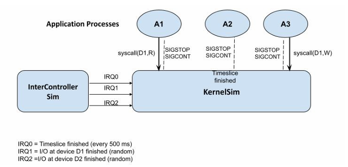

# KernelSim-Simulator
## Introdução
O primeiro trabalho consiste em programar (em linguagem C e usando as primitivas fork/exec, sinais e comunicação Inter processos do Unix/Linux) um simulador de um kernel/núcleo de sistema operacional (KernelSim) que gerencia de 5 processos de aplicação (A1, A2, A3, A4, A5) e intercala as suas execuções a depender se estão esperando pelo término de uma operação de leitura ou escrita em um dispositivo de E/S simulado (sendo que há dois deles, D1 e D2), ou o uma interrupção sinalizando o termino de uma “fatia de tempo” (i.e. um time slice, ou intervalo de tempo para escalonamento RoindRobin).  Para isso você deverá implementar também um processo adicional que emula o controlador de interrupções (InterContoler Sim). Este deve gerar as interrupções referentes ao time-slice e ao término da operação de E/S nos dispositivos D1 e D2, onde a interrupção IRQ0 é do TimeSlice, interrupção IRQ1 indica o termino da operação requisitada em dispositivo D1, e IRQ2 o término da operação no dispositivo D2. Figura 1 mostra 
os elementos que devem fazer parte de seu sistema. 

Figura 1: principais processos do seu sistema. 

No seu programa, cada um dos elementos em azul-cinza da Fig. 1 deve ser um processo Unix. 

Tanto InterController Sim como KernelSim devem ser processos infinitos que executam em pararelo.  

## Uso de Sinais UNIX 
Para emular as interrupções (geradas por InterController Sim) e tratadas por KernelSim, você pode usar qualquer mecanismo de comunicação IPC, como pipes, Shmem ou FIFO, e deve usar os sinais SIGSTOP e SIGCONT para permitir que o KernelSim interrompa e retome, respectivamente, a execução dos processos de aplicação A1,.., A5. 

## Time-sharing  
Qualquer processo Ax pode executar ininterruptamente no máximo durante TimeSlice segundos.  Portanto, quando chega um IRQ0 (Time Slice), KernelSim, deve enviar um SIGSTOP para o processo que estava executando, e escolher outro processo de aplicação Ay e novamente ativar o mesmo usando o sinal SIGCONT, a menos que este processo esteja esperando pelo retono de uma syscall de E/S para D1 ou D2. Mais ainda, se dois processos, digamos Ay e Az, tiverem executado uma syscall para o mesmo dispositivo, digamos D2, (e a chamada de Ay aconteceu antes da chamada de Az), então o primeiro IRQ2 representará o término da primeira chamada (e irá desbloquear Ay)  e o segundo IRQ2 sinalizará o termino do segundo syscall (e irá desbloquear Az).  

## Chamada de Sistema (syscall) 
Quando um processo de aplicação, digamos A1, executar um syscall(D2,W), isso que faz com que seja imediatamente interrompido pelo KernelSim através de um sinal SIGSTOP e insere A1 na fila de processos bloqueados à espera do dispositivo D2, em uma fila interna. Eventualmente, InterController Sim irá gerar um novo IRQ2, o que causará a liberação do primeiro processo que está na fila dos bloqueados por D2, e o KernelSim irá poder desbloquear o A1 usando SIGCONT. 

Em vez de simularmos um tempo específico que cada um dos dispositivos D1 e D2 precisam para executar as operações R/W solicitadas pela syscall(), faremos o InterConntollerSim gerar aleatoriamente interrupções para cada dispositivo (D1/D2) que indicam o termino de qualquer pedido de IO no dispositivo correspondente.  

Para isso, implemente o InterConntoller Sim para gerar: 

 - Um IRQ0 (TimeSlice) a cada 500 ms (use sleep() dentro do corpo do loop) 
 - Um IRQ1 com probabilidade P_1 = 0.1 (a cada 500 ms) 
 - Um IRQ2 com probabilidade P_2 = 0.05 (a cada 500 ms) 
 
 Obs: Se você achar que essas frequências estão dificultando visualizar a execução, você pode alterar a periodicidade do Timslice e as probabilidades de P_1 e P_2, mas a sempre mantendo a probabilidade de P_1 vinte vezes maior do que a de P_2. É como se o dispositivo D1 fosse, na média, 20 x mais rápido do que o D2. 
 
## Processos de Aplicação 
Cada processo de aplicação Ax deve consistir de um loop de até MAX iterações e ter um contador de interações chamado de ProgramCounter (PC).   

No corpo do loop deverá haver um sleep(1), e uma escolha randômica, com baixa probabilidade, do processo de aplicação requsitar um syscall, para leitura ou escrita no dispositivo Dx, - syscall(Dx,R/W/X)- onde a escolha de D1 ou D2, e da operação R, W ou X são randômicos também. 

Exemplo: 

    while (PC < MAX) {
        sleep(0.5);
        if (d = rand() % 100 + 1 < 15) { // generate a random syscall 
                if (d % 2) Dx = D1
                else Dx = D2;
                if (d % 3 == 1) Op = R
                else if (d % 3 = 1) Op = W
                else Op = X;
                // generate syscall (Dx, Op) 
        }
        sleep(0.5);
    }
  
## Troca de Contexto 
No seu sistema a troca de contexto acontecerá a cada vez que houver o chaveamento de um processo de aplicação para um outro. E no caso especifico do seu programa esse contexto deve ser o contador PC do processo. Então, ao reativar um processo anteriormente interrompido o seu contexto completo anteriormente salvo deve ser restaurado, em parte para garantir que todos os processos de aplicação Ax executem exatamente MAX interações. Além disso, se se a interrupção de um processo se deveu a um syscall, então os parâmetros do syscall (D1 ou D2, R/W ou X) também devem fazer parte do contexto salvo e restaurado do processo. 

## Visualizando os estados dos processos 
Além disso, seu simulador, em especial o InterController Sim, deve poder ser interrompido e reiniciar do ponto em que parou através do uso de sinais da linha de comando (tipo Cntr-C PID_simulador) e quando estiver parado, deve mostrar as seguintes informações sobre todos os 
processos APx: 

 - valor do PC;
 - em que estado está;
 - se estiver bloqueado, em qual dispositivo e com qual operação;
 - se está executando (porque o KernelSim enviou um SIGCONT e ainda não um SIGSTOP para ele);
 - desde o inicio da execução e até esse valor de PC, quantas vezes o processo AP acessou cada um dos dispositivos;
 - e se estiver terminado.
